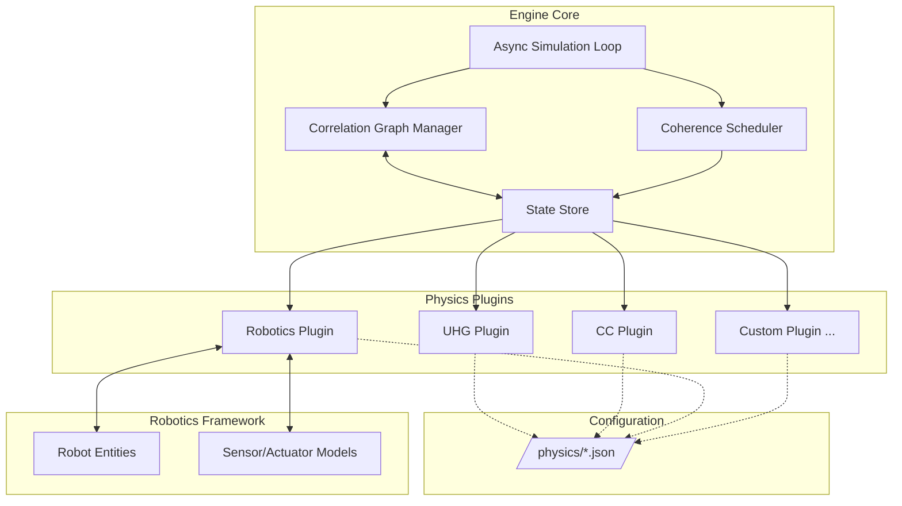

# **Pygnosis Physics Engine (Enhanced for Unified Holographic Gnosis & Correlation Continuum)**

## **Overview**

The Pygnosis Physics Engine is a Python‑based, modular simulation framework that implements the principles of **Unified Holographic Gnosis (UHG)** and the **Correlation Continuum (CC)**. It is designed to serve as the core simulation layer for the Pygnosis Minecraft server, but can also run standalone for scientific or robotics simulations. The engine leverages **coherence‑aware scheduling**, **sparse correlation graphs**, and **JIT‑compiled kernels** to achieve extreme efficiency while remaining flexible through a plugin architecture.

---

## **1. Core Architecture**



### **1.1 Core Components**

- **Async Simulation Loop** (`asyncio` based)  
  - Runs at a fixed tick rate (default 20 Hz, configurable).  
  - Each tick, the loop queries the **Coherence Scheduler** for the set of active regions and entities to simulate.  
  - Dispatches simulation tasks to worker threads/processes (if multiprocessing enabled) and awaits results asynchronously.  
  - Handles I/O (network, disk) without blocking the simulation.

- **Correlation Graph Manager**  
  - Maintains a sparse, dynamic graph of **correlation operators** `O_i` (blocks, entities, fields).  
  - Each operator has a **coherence value** `CI` (float) and a **type** (e.g., `Block`, `Player`, `Robot`).  
  - Edges represent interactions (e.g., neighbour blocks, player–block, robot–sensor).  
  - The graph is stored in a memory‑efficient format using `array` and `dict` structures, with indices into global operator tables.

- **Coherence Scheduler**  
  - Implements **H₁₃** and **H₁₄** to allocate simulation budget (CPU time) across operators.  
  - For each operator, computes a **target coherence** based on:  
    - Player proximity  
    - Redstone activity  
    - Pending external events (e.g., robot commands)  
    - Plugin‑defined priorities  
  - Operators with `CI` below a threshold are **compressed** (removed from active graph, stored in boundary store).  
  - The scheduler also manages the **federated coherence** across multiple worker processes, ensuring total coherence is conserved.

- **State Store**  
  - A unified interface for accessing and modifying simulation state.  
  - For continuum regions (active operators), data is held in **NumPy arrays** (block palettes, light levels, etc.).  
  - For boundary regions (compressed chunks), data is stored in **memory‑mapped files** using a compact binary format.  
  - Provides fast random access via coordinate hashing.

---

## **2. Physics Plugins & JSON Configuration**

Plugins are the primary way to define physics models. Each plugin is a Python module that implements a standard interface and is configured by a JSON file placed in `/physics/`.

### **2.1 Plugin Interface**

```python
# physics_plugin.py (example)
class PhysicsPlugin:
    def __init__(self, config):
        self.config = config
        self.operators = {}  # custom operator types

    def initialize(self, state):
        """Set up initial conditions, register operator types."""
        pass

    def step(self, dt, scheduler_decision):
        """Advance simulation for the operators assigned by scheduler."""
        # scheduler_decision is a list of operator IDs to update
        pass

    def get_observables(self):
        """Return diagnostic data (e.g., gravitational waves)."""
        return {}
```

Plugins are loaded dynamically at startup from the `/physics/` directory.

### **2.2 JSON Configuration**

Each plugin has a JSON file that defines:

- **plugin**: Python module path (e.g., `plugins.uhg_plugin`).  
- **theory**: Name of the theory (UHG, CC, custom).  
- **parameters**: Theory‑specific constants.  
- **coupling**: How this plugin interacts with others (shared operators, exchange terms).  
- **scheduler_hints**: Default priority, min/max coherence, etc.

Example `uhg_config.json`:

```json
{
  "plugin": "pygnosis.physics.plugins.uhg",
  "theory": "UHG",
  "version": "1.0",
  "parameters": {
    "CI_B_initial": 0.95,
    "CI_C_initial": 0.05,
    "alpha": 0.5,
    "beta": 0.2,
    "reciprocity_threshold": 1.15
  },
  "topology": {
    "defect_detection_threshold": 0.8,
    "phase_transition_temperature": 8.314e12
  },
  "scheduler_hints": {
    "base_priority": 1.0,
    "min_coherence": 0.1,
    "max_coherence": 1.0
  },
  "coupling": {
    "shared_operators": ["block", "player"],
    "exchange_terms": ["sigma_topo"]
  }
}
```

Example `cc_config.json`:

```json
{
  "plugin": "pygnosis.physics.plugins.cc",
  "theory": "CC",
  "version": "1.0",
  "parameters": {
    "lambda": 1.702e-35,
    "T_c": 8.314e12,
    "tau_u": 4.192e-21,
    "hbar": 1.0545718e-34,
    "c": 299792458,
    "G": 6.67430e-11,
    "k_B": 1.380649e-23
  },
  "solver": {
    "method": "rk4",
    "cfl": 0.5
  },
  "scheduler_hints": {
    "base_priority": 0.8,
    "min_coherence": 0.05
  }
}
```

All plugin configs are loaded by the **Configuration Manager** and injected into the plugin instances at startup.

---

## **3. Robotics Framework Compatibility**

The physics engine is designed to serve as the **simulation backend** for the Pygnosis robotics framework. Robots are represented as **correlation operators** with their own state (position, velocity, joint angles) and interaction rules.

### **3.1 Robot as Correlation Operator**

A robot entity is a composite operator consisting of:

- **Body**: A set of blocks or shapes (for collision).  
- **Sensors**: Operators that read the environment (light, distance, etc.).  
- **Actuators**: Operators that apply forces or change the robot’s state.  
- **Controller**: A plugin‑defined logic that maps sensor inputs to actuator outputs.

The robot’s dynamics follow the same fundamental laws as any other object: gravity, friction, collision, etc. However, its controller can override these with custom commands.

### **3.2 Sensor Simulation**

Sensors are implemented as **observable operators** that query the correlation graph. For example:

- A **distance sensor** measures the coherence‑weighted distance to the nearest block in a direction.  
- A **camera** returns a low‑resolution image generated from block types in view (using ray‑marching).

Sensor data is computed on‑demand when the robot’s controller requests it, avoiding unnecessary computation.

### **3.3 Actuator Control**

Actuators (wheels, joints, grippers) apply forces or torques to the robot’s body. They are implemented as **correlation updates** that modify the robot’s momentum or configuration. The physics engine ensures that these updates obey conservation laws (via H₁₃).

### **3.4 Plugin for Robotics**

A dedicated `robotics_plugin` handles:

- Registration of robot types and their components.  
- Communication between the robot’s controller (which may run in a separate process) and the physics engine via a message queue.  
- Synchronisation of robot state with the Minecraft world (for visualisation).

Configuration (`robotics_config.json`):

```json
{
  "plugin": "pygnosis.physics.plugins.robotics",
  "theory": "Robotics",
  "version": "1.0",
  "robot_types": {
    "simple_drive": {
      "body": "cube",
      "sensors": ["distance_front", "light"],
      "actuators": ["left_wheel", "right_wheel"],
      "controller": "robotics.controllers.differential_drive"
    }
  },
  "scheduler_hints": {
    "base_priority": 1.2,
    "min_coherence": 0.3
  }
}
```

---

## **4. Optimization Techniques**

### **4.1 JIT‑Compiled Kernels with Numba**

Critical loops (e.g., light propagation, fluid dynamics, gravity updates) are written in Python and decorated with `@njit` (Numba’s just‑in‑time compiler). This yields performance close to C while keeping the code readable.

Example:
```python
from numba import njit

@njit
def propagate_light(block_array, light_array, spread_falloff):
    # block_array: 3D int palette indices
    # light_array: 3D uint8
    # ...
```

### **4.2 Sparse Correlation Graph**

- Only operators with `CI > threshold` are kept in the active graph.  
- Edges are stored as adjacency lists using `array('I')` for indices.  
- Bulk operations (e.g., player movement) update the graph incrementally without full scans.

### **4.3 Memory‑Mapped Boundary Store**

- Inactive chunks are stored in **Zstandard‑compressed** binary files, memory‑mapped via `mmap`.  
- Decompression is lazy: when a chunk is needed, its data is decompressed into a NumPy array and added to the active graph.  
- The compression format is custom but borrows from Cuberite’s `cChunkDesc`: palette, heightmap, block light, sky light, and a sparse delta for modifications.

### **4.4 Coherence‑Aware Scheduling**

The scheduler uses a **priority queue** of operators, ordered by a combination of:

- Current coherence `CI`
- Derivative `dCI/dt` (rate of change)
- Plugin‑defined base priority

Each tick, the top `N` operators (where `N` is dynamically adjusted based on system load) are simulated. The remaining operators are either skipped or compressed.

### **4.5 Asynchronous I/O and Multiprocessing**

- All disk and network operations use `asyncio` to avoid blocking the simulation loop.  
- For CPU‑bound tasks, the scheduler can farm out simulation of disjoint regions to separate processes using `multiprocessing`. The **federated coherence** axiom H₁₄ ensures that the sum of coherences across processes remains constant, enabling load balancing.

### **4.6 Predictive Caching**

- Player paths are predicted using a simple extrapolation model, and chunks along the predicted path are inflated preemptively.  
- Robot controllers can also hint at future actions, allowing the physics engine to allocate coherence ahead of time.

---

## **5. Directory Structure**

```
pygnosis/
├── physics/
│   ├── __init__.py
│   ├── engine.py                 # Main simulation loop, scheduler
│   ├── graph.py                   # CorrelationGraphManager
│   ├── state.py                   # StateStore
│   ├── config.py                  # ConfigurationManager
│   ├── plugins/
│   │   ├── __init__.py
│   │   ├── uhg_plugin.py
│   │   ├── cc_plugin.py
│   │   ├── robotics_plugin.py
│   │   └── ...
│   └── configs/                    # JSON files (symlinked or copied)
│       ├── uhg_config.json
│       ├── cc_config.json
│       ├── robotics_config.json
│       └── ...
├── robotics/
│   ├── __init__.py
│   ├── controllers/                # Robot control logic
│   ├── sensors/                     # Sensor models
│   └── actuators/                    # Actuator models
└── ...
```

---

## **6. Integration with Pygnosis Server**

The physics engine runs as a **background service** within the Pygnosis server process. It communicates with other components via asynchronous message passing:

- **World Loader** requests chunks from the engine (via `StateStore`).  
- **Network Layer** sends player actions to the engine as correlation updates.  
- **Plugin System** exposes the engine’s API to Lua/Python plugins.

The engine’s scheduler ensures that the server remains responsive even under heavy load by dynamically throttling simulation detail.

---

## **7. Example: Running a UHG+CC Coupled Simulation**

```python
import asyncio
from pygnosis.physics.engine import PhysicsEngine

async def main():
    engine = PhysicsEngine()
    await engine.load_config("physics/configs/uhg_config.json")
    await engine.load_config("physics/configs/cc_config.json")
    await engine.start()
    # ... let it run ...
    await engine.stop()

asyncio.run(main())
```

---

## **8. Conclusion**

The enhanced Pygnosis Physics Engine marries the profound insights of Unified Holographic Gnosis and the Correlation Continuum with practical software engineering. By leveraging Python’s ecosystem (NumPy, Numba, asyncio) and a plugin architecture with JSON configuration, it provides a flexible, high‑performance foundation for both Minecraft simulation and robotics research. The coherence‑driven approach ensures that memory and CPU are always used where they matter most, paving the way for a server that runs in under 20 MB RAM while outperforming traditional implementations.

---

*All configurations and plugins must preserve the truth‑seeking intent of the original theories and be used ethically.*
