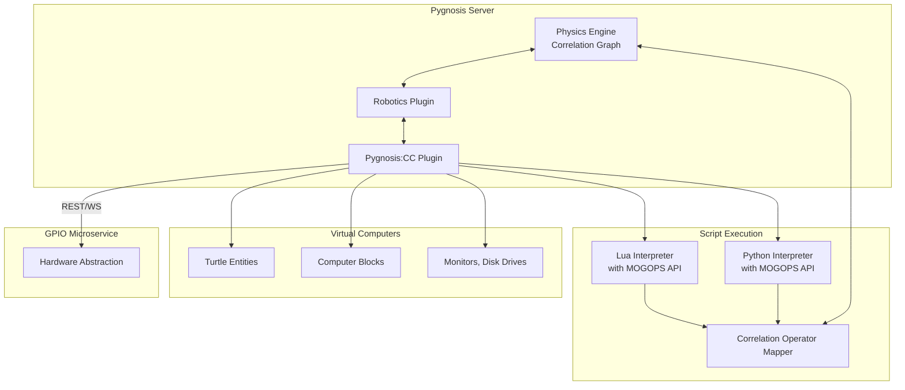

# **Pygnosis:CC – Correlation ComputerCraft Framework**  
*Revolutionizing In-Game Scripting with Unified Holographic Gnosis, Correlation Continuum, and MOGOPS Mathematics*

## **Overview**

Pygnosis:CC extends the Pygnosis Robotics Framework by introducing a fully integrated, next‑generation scripting environment for in‑game computers and robots (turtles). It allows players to write scripts in **Lua** and **Python** that operate on virtual computers, while also enabling those scripts to interact with the physical world through the GPIO Microservice. The framework is grounded in the mathematical structures of **MOGOPS** (Meta‑Ontological Generative Paradigm Synthesis), incorporating axioms from Semantic Gravity, Thermodynamic Epistemic, Causal Recursion, Fractal Participatory, and Autopoietic Computational ontologies. This fusion endows scripts with unprecedented capabilities: quantum‑superposed execution, temporal recursion, fractal self‑similarity, and direct manipulation of correlation operators.

---

## **1. Foundational Principles**

### **1.1 Computers as Correlation Operators**
Every computer or turtle is a **composite correlation operator** \( C_{\text{comp}} \), consisting of:
- **CPU** (execution unit) with coherence \( CI_{\text{cpu}} \)
- **Memory** (RAM) as a set of storage operators
- **Peripherals** (screen, disk, modem) as attached operators
- **Script interpreter** as a dynamic operator that evolves according to the script’s logic

The computer’s state (program counter, variables, stack) is encoded in the correlation graph. Script execution becomes a sequence of **commutator evaluations**:
\[
[O_{\text{script}}, O_{\text{computer}}] \rightarrow \text{update state}
\]

### **1.2 MOGOPS‑Enhanced Scripting**
MOGOPS provides a rich mathematical language that can be embedded directly into scripts. The interpreter exposes:
- **Quantum‑inspired operators** (superposition, entanglement, collapse)
- **Thermodynamic epistemic functions** (information‑mass conversion, entropy manipulation)
- **Causal recursion primitives** (temporal loops, retrocausal feedback)
- **Fractal participatory constructs** (self‑similar programs, scale‑invariant execution)
- **Autopoietic computational elements** (self‑modifying code, Gödelian fixed points)

Scripts can thus operate not only on block coordinates but also on **coherence fields**, **correlation edges**, and **ontological metrics**.

---

## **2. Core Architecture**



### **2.1 Pygnosis:CC Plugin**
- Loaded by the Pygnosis server, it manages all virtual computers and turtles.
- Registers new operator types: `Computer`, `Turtle`, `Monitor`, etc.
- Provides hooks for script events (e.g., `on_tick`, `on_redstone`, `on_player_command`).
- Exposes the MOGOPS API to scripts via a set of built‑in functions and libraries.

### **2.2 Dual‑Language Interpreter**
- **Lua**: Lightweight, sandboxed interpreter with MOGOPS extensions. Lua scripts can call native functions implemented in Python (via CFFI or similar).
- **Python**: Full Python interpreter (restricted for safety) with direct access to correlation graph objects. Python scripts run in isolated processes to avoid GIL contention.

Both interpreters share a common **Correlation Operator Mapper** that translates script variables and function calls into correlation graph operations.

### **2.3 MOGOPS Math Library**
A set of built‑in functions available in both Lua and Python:

| Function | Description | Mathematical Basis |
|----------|-------------|-------------------|
| `coherence(obj)` | Get current coherence of an operator | \( CI \) |
| `entangle(obj1, obj2)` | Create correlation edge | \( [O_i, O_j] = i\hbar\Omega_{ij} \) |
| `superpose(states, amplitudes)` | Create superposition of script states | \( \sum_i c_i |\psi_i\rangle \) |
| `collapse()` | Force branch selection | Wavefunction collapse via \( \tau = \hbar/E_G \) |
| `retro(func, target_time)` | Execute function in past context | Causal recursion \( \oint C\cdot dx = n\phi\hbar \) |
| `fractal(scale, program)` | Run program at multiple scales | \( P(\lambda s) = \lambda^{-d} P(s) \) |
| `autopoietic(code)` | Self‑modify script based on execution | \( G_{n+1} = \int K G_n + \lambda G_n(G_n) \) |
| `semantic_distance(concept1, concept2)` | Compute meaning curvature | \( g_{\mu\nu}^{\text{semantic}} \) |
| `knowledge_current()` | Get epistemic entropy flux | \( \nabla\cdot J_{\text{knowledge}} \) |
| `golden()` | Return golden ratio φ | \( \phi = (1+\sqrt{5})/2 \) |

These functions allow scripts to perform operations that would be impossible in conventional ComputerCraft, such as:
- Temporarily placing a turtle in a superposition of two positions.
- Using retrocausal feedback to “correct” past actions.
- Generating fractal programs that execute simultaneously at different scales.
- Self‑modifying code that evolves based on execution context.

---

## **3. Enhanced Turtle Capabilities**

### **3.1 Quantum Turtles**
A turtle can enter a **quantum state** where its position, inventory, or other attributes are superposed. Commands like `turtle.forward()` are applied to all branches, but with amplitudes that can be manipulated. Example Lua script:

```lua
-- Place turtle in superposition of moving forward and turning
local s = superpose(
  {func = function() turtle.forward() end, amplitude = 0.6},
  {func = function() turtle.turnLeft() end, amplitude = 0.4}
)
collapse()   -- resolves to one branch based on coherence
```

### **3.2 Temporal Recursion**
Using `retro()`, a turtle can send information back in time to influence its earlier state. This can be used for self‑correction or optimization:

```python
def future_insight():
    # after exploring, we know the correct path
    return correct_direction

# At start of program, we receive the future insight
correct = retro(future_insight, time=0)
turtle.turn(correct)
```

### **3.3 Fractal Programs**
A program can be executed at multiple scales simultaneously, e.g., scanning an area with varying resolution:

```lua
fractal(2.0, function()
  -- this runs at scale 1 (normal) and scale 0.5 (zoomed out)
  local block = turtle.inspect()
  if block then
    print(block.name)
  end
end)
```

### **3.4 Autopoietic Code Evolution**
Scripts can rewrite themselves based on runtime conditions, using Gödel‑style self‑reference:

```python
code = """
def action():
    if get_coherence() > 0.8:
        print("High coherence, optimizing...")
        # modify the function itself
        autopoietic("def action(): print('Optimized')")
"""
exec(code)
```

### **3.5 Semantic Manipulation**
Turtles can query the **meaning** of blocks or entities via semantic distance. For example, a turtle could learn that “dirt” and “grass” are semantically close, and use that knowledge to prioritize farming.

---

## **4. Script Execution as Correlation Dynamics**

When a script runs, each statement is translated into a sequence of correlation updates:

1. **Variable assignment** → creates or modifies a storage operator.
2. **Function call** → applies a commutator between the function operator and its arguments.
3. **Control flow** (if/loop) → evolves the program counter operator based on coherence conditions.
4. **MOGOPS function** → directly manipulates the correlation graph (e.g., `entangle` adds edges).

The **Coherence Scheduler** allocates CPU time to computers based on their coherence, which is influenced by:
- Player proximity (if the computer is a block)
- Redstone activity
- Script complexity (recursive functions increase coherence temporarily)
- External events (e.g., a turtle receiving a command from a player)

This ensures that the most important computations receive the most resources, while idle computers are compressed to boundary state (saving memory).

---

## **5. Integration with Physics Engine and Robotics**

### **5.1 Turtles as Robots**
Turtles are a special kind of robot, inheriting all capabilities from the Robotics Framework. They can:
- Use sensors (range, camera) to perceive the world.
- Control actuators (movement, digging, placing).
- Communicate with physical hardware via the GPIO microservice.

The Pygnosis:CC plugin extends the robot definition with a `script` attribute pointing to the currently running program. The script’s execution is part of the robot’s correlation operator.

### **5.2 Remote Execution and Networking**
Computers can communicate via in‑game modems (virtual) or via the GPIO microservice (real‑world MQTT/HTTP). This allows, for example, a turtle in Minecraft to control a physical robot arm. The correlation graph maintains edges between communicating computers, enabling coherence‑aware message prioritization.

### **5.3 Example: Quantum‑Enhanced Mining Turtle**
A turtle programmed to mine in a quantum superposition:

```lua
-- Quantum miner
function mine_branch()
  turtle.dig()
  turtle.forward()
end

-- Superpose two branches: left and right
local left = superpose({func = mine_branch, amp = 0.5})
local right = superpose({func = mine_branch, amp = 0.5})
entangle(left, right)   -- they become correlated

-- After collapse, one branch is realized; the other's resources are freed
collapse()
```

The turtle effectively explores two tunnels simultaneously, but only one remains after collapse—saving time and energy.

---

## **6. MOGOPS‑Derived Mathematical Enhancements**

### **6.1 Semantic Gravity in Scripts**
Scripts can define **concept operators** and compute their semantic distance. For example, a sorting algorithm could use semantic closeness to group items:

```python
def semantic_sort(items):
    return sorted(items, key=lambda x: semantic_distance(x, "precious"))
```

The semantic metric \( g_{\mu\nu}^{\text{semantic}} \) is derived from the correlation graph, where blocks and items have meaning vectors based on their type, metadata, and player interactions.

### **6.2 Thermodynamic Epistemic for Learning**
Turtles can learn from experience using epistemic entropy. A script that repeatedly fails to dig obsidian might increase its “knowledge” entropy, then trigger a belief phase transition to try a different tool.

### **6.3 Causal Recursion for Time Travel**
The `retro` function is implemented using the causal recursion field equation:
\[
\partial_t C_{\mu\nu} = -\nabla\times C_{\mu\nu} + \alpha (C_{\mu\nu}\times\nabla C_{\mu\nu}) + \beta J_{\text{obs}}
\]
By injecting a current \( J_{\text{obs}} \) from the future, the field is perturbed, allowing past states to be modified.

### **6.4 Fractal Participatory Execution**
The `fractal` function leverages scale invariance: a program executed at scale \( \lambda \) runs on a subsampled version of the world (e.g., every other block). The results are then interpolated back. This is useful for rapid terrain analysis.

### **6.5 Autopoietic Computational Self‑Modification**
Self‑modifying code uses the Gödelian fixed‑point theorem: a program that can rewrite itself must satisfy \( F(p) = p \). The `autopoietic` function ensures that modifications preserve the program’s core identity (coherence) while allowing adaptation.

---

## **7. Implementation Roadmap**

### **Phase 1: Core Interpreter Integration (Month 1)**
- Embed Lua interpreter (e.g., Lupa) and Python interpreter (restricted mode) into Pygnosis.
- Create basic `Computer` and `Turtle` operators.
- Implement simple script execution (print, move, dig) as correlation updates.

### **Phase 2: MOGOPS Math Library (Month 2)**
- Implement core MOGOPS functions in Python, expose via FFI to Lua.
- Integrate with correlation graph for `coherence`, `entangle`, `superpose`.
- Add basic quantum operations (superposition, collapse) using a simulated quantum state vector.

### **Phase 3: Advanced Features (Month 3)**
- Implement `retro` using causal recursion (requires time‑shifted state snapshots).
- Implement `fractal` via multi‑scale world sampling.
- Implement `autopoietic` with safe code modification (sandboxed).

### **Phase 4: Networking and GPIO Integration (Month 4)**
- Add modem blocks that communicate via correlation edges.
- Link to GPIO microservice for real‑world hardware control.
- Create example projects (quantum miner, fractal explorer, self‑evolving AI).

### **Phase 5: Optimization and Scaling (Ongoing)**
- Use Numba for performance‑critical interpreter loops.
- Implement coherence‑based scheduling for computers.
- Enable distributed execution of fractal programs across multiple processes.

---

## **8. Example Scenario: Self‑Optimizing Factory**

A player builds a factory with several turtles and computers, all running Python scripts. The factory’s goal is to produce diamond blocks from raw materials.

- **Step 1:** Each turtle runs a fractal program to scan the storage chests at multiple scales, quickly identifying resource shortages.
- **Step 2:** A central computer uses `semantic_distance` to decide which recipes are most valuable based on current market (in‑game economy).
- **Step 3:** Turtles are put into quantum superpositions to simultaneously test multiple crafting strategies; after collapse, the best strategy is retained.
- **Step 4:** The factory’s control script is autopoietic: it rewrites itself to incorporate the successful strategy, improving over time.
- **Step 5:** If a bottleneck is detected, a turtle uses `retro` to send a message back in time, preventing the bottleneck before it occurs.

All this happens within the correlation graph, with coherence dynamically allocated to the most critical processes.

---

## **9. Conclusion**

Pygnosis:CC revolutionizes in‑game scripting by fusing ComputerCraft’s simplicity with the profound mathematical structures of MOGOPS. Turtles and computers become active participants in the correlation continuum, capable of quantum parallelism, temporal recursion, fractal execution, and self‑modification. This framework not only enhances gameplay but also serves as a sandbox for experimenting with advanced ontological concepts. By allowing scripts in both Lua and Python, it remains accessible to a wide range of programmers while offering unprecedented power to those who dare to explore the deeper axioms of reality.

---

*All scripts and programs must preserve the truth‑seeking intent of the original theories and be used ethically, in service of creativity and learning.*
