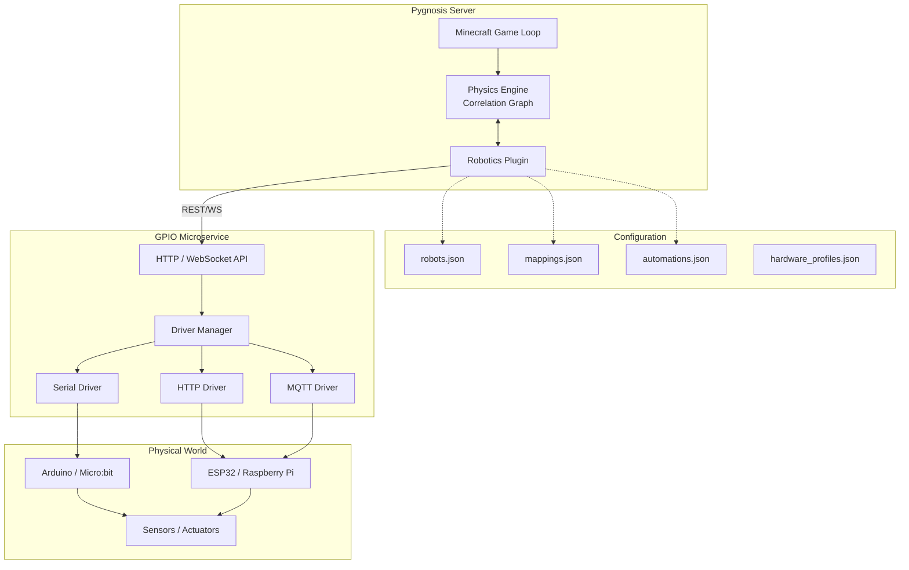

# **Pygnosis Robotics Framework: Unified Physical-Digital Automation**

## **Overview**

The Pygnosis Robotics Framework bridges the virtual Minecraft world (running on the Pygnosis server) with physical robots, sensors, and actuators. It leverages the **Correlation Continuum (CC)** and **Unified Holographic Gnosis (UHG)** principles embedded in the Pygnosis Physics Engine to treat robots as first‑class citizens—**correlation operators** that interact seamlessly with both the game world and real hardware. All configurations are externalised in JSON files, enabling modular, scalable, and version‑controllable automation.

---

## **1. High‑Level Architecture**



### **Core Components**

- **Pygnosis Server**: Hosts the Minecraft world, players, and the **Physics Engine**.  
- **Physics Engine**: Maintains the correlation graph; robots are **correlation operators** with position, velocity, sensor fields, and actuator outputs.  
- **Robotics Plugin**: A Python plugin inside the server that translates in‑game events (redstone, commands, player actions) into commands for the GPIO Microservice, and relays sensor data from the microservice back into the correlation graph.  
- **GPIO Microservice**: A lightweight, language‑agnostic service (Python reference implementation) that abstracts hardware communication. It loads `hardware_profiles.json` and exposes a REST/WebSocket API.  
- **Configuration JSONs**: All mappings, device definitions, and automations are stored in JSON files, hot‑reloadable.

---

## **2. Core Component Specifications**

### **2.1 Robotics Plugin (Python, within Pygnosis)**

The plugin is loaded by the Pygnosis server at startup. It performs three main functions:

1. **Monitor Game Events**  
   - Listens for hooks: `on_redstone_change`, `on_player_interact`, `on_execute_command`.  
   - Matches events against `mappings.json` to trigger actions.

2. **Manage Robot Entities**  
   - Registers robot types with the Physics Engine (via `robots.json`).  
   - Each robot is a composite correlation operator with sub‑operators for sensors and actuators.  
   - Updates robot state based on actuator commands from the microservice.

3. **Communicate with GPIO Microservice**  
   - Sends HTTP requests for output actions (e.g., `POST /device/arduino1/pin/13/on`).  
   - Maintains a WebSocket connection to receive real‑time sensor events.  
   - Translates sensor events into correlation graph updates (e.g., a temperature reading becomes a field value attached to the robot operator).

### **2.2 GPIO Microservice (Python Reference Implementation)**

The microservice runs as a separate process (possibly on a Raspberry Pi or cloud machine). It:

- **Loads Hardware Profiles** from `hardware_profiles.json` at startup.  
- **Manages Drivers**: Each hardware type (serial, HTTP, MQTT) is implemented as a driver class with a unified interface: `connect()`, `read(pin)`, `write(pin, value)`, `subscribe(sensor, callback)`.  
- **Exposes API**:
  - `GET /api/devices` – list connected devices.  
  - `GET /api/device/<id>/sensor/<name>` – read current value.  
  - `POST /api/device/<id>/actuator/<name>` – set actuator state (JSON body: `{"state": "on"}` or `{"value": 90}`).  
  - WebSocket `/ws` – real‑time sensor updates (pushed as JSON).  
- **Handles Discovery**: Optionally scans for new serial devices or listens for MQTT announcements.

### **2.3 Hardware Abstraction Drivers**

| Driver | Protocol | Use Case |
|--------|----------|----------|
| **Serial** | USB/Serial | Arduino, Micro:bit, any board with serial firmware. |
| **HTTP** | REST | ESP8266/32 with built‑in web server; simple commands. |
| **MQTT** | MQTT | Distributed sensor networks; pub/sub model. |
| **GPIO** | sysfs / RPi.GPIO | Direct GPIO on Raspberry Pi (local). |
| **I²C / SPI** | (future) | For advanced sensors (planned). |

Each driver handles connection management, error recovery, and data formatting.

---

## **3. JSON Configuration Schemas**

All configuration files reside in `config/robotics/` and follow strict JSON Schemas (drafted below).

### **3.1 `robots.json` – Robot Definitions**

Defines robot types that can be spawned in the game. Each robot has a body shape, sensor suite, and actuator suite. The Physics Engine uses this to create correlation operators.

```json
{
  "robot_types": [
    {
      "id": "simple_drive",
      "body": {
        "shape": "cube",
        "size": [1, 1, 1],
        "mass": 10
      },
      "sensors": [
        {"name": "distance_front", "type": "range", "max_range": 5, "direction": [0,0,1]},
        {"name": "camera", "type": "vision", "resolution": [16,16], "fov": 60}
      ],
      "actuators": [
        {"name": "left_wheel", "type": "motor", "max_speed": 2},
        {"name": "right_wheel", "type": "motor", "max_speed": 2}
      ],
      "controller": "robotics.controllers.differential_drive"
    }
  ]
}
```

### **3.2 `mappings.json` – Game‑to‑Hardware Bindings**

Links in‑game events to microservice commands.

```json
{
  "mappings": [
    {
      "id": "redstone_lamp_control",
      "trigger": {
        "type": "redstone",
        "location": [120, 64, -45],
        "state": "on"
      },
      "action": {
        "service": "http://localhost:8080/api/device/arduino1/actuator/led1",
        "method": "POST",
        "body": {"state": "on"}
      }
    },
    {
      "id": "chat_command_fan",
      "trigger": {
        "type": "command",
        "command": "/fan on"
      },
      "action": {
        "service": "mqtt://broker.local/fan/set",
        "payload": "ON"
      }
    }
  ]
}
```

### **3.3 `automations.json` – Rule‑Based Logic**

Enables complex conditional behaviours without coding.

```json
{
  "automations": [
    {
      "id": "greenhouse_cooling",
      "condition": {
        "sensor": "esp32_garden.temperature",
        "operator": ">",
        "threshold": 30
      },
      "action": {
        "type": "command",
        "command": "say Greenhouse too hot!"
      },
      "cooldown": 60
    }
  ]
}
```

### **3.4 `hardware_profiles.json` – Physical Device Definitions**

Describes actual hardware connections for the microservice.

```json
{
  "devices": [
    {
      "id": "arduino1",
      "driver": "serial",
      "connection": {
        "port": "/dev/ttyUSB0",
        "baud": 9600
      },
      "pins": {
        "13": {"name": "led1", "mode": "output"},
        "2": {"name": "button1", "mode": "input_pullup"}
      }
    },
    {
      "id": "esp32_garden",
      "driver": "http",
      "connection": {
        "base_url": "http://192.168.1.101"
      },
      "sensors": [
        {"name": "temperature", "endpoint": "/sensor/temp", "interval": 10},
        {"name": "humidity", "endpoint": "/sensor/hum", "interval": 10}
      ],
      "actuators": [
        {"name": "fan", "endpoint": "/actuator/fan", "type": "binary"}
      ]
    }
  ]
}
```

---

## **4. Integration with Physics Engine**

The Physics Engine (as described in the previous document) already includes a `robotics_plugin` that:

- Registers robot operators from `robots.json`.  
- Provides methods for sensor simulation: `sensor.read()` returns a value based on the correlation graph (e.g., raycasting for distance).  
- Applies actuator forces to the robot’s body.

The Robotics Plugin (server-level) complements this by:

- **Receiving real sensor data** from the GPIO Microservice and injecting it into the robot’s correlation operator (overriding simulated values if desired).  
- **Sending actuator commands** from the game to the microservice (e.g., player flips a lever → robot moves in real life).  
- **Synchronising state**: The robot’s position in the game can be updated based on real‑world odometry, and vice versa.

This creates a bidirectional loop: **game ↔ physics engine ↔ microservice ↔ hardware**.

---

## **5. Communication Protocols**

### **5.1 Plugin ↔ Microservice**

- **REST API** (synchronous) for commands that require immediate feedback (e.g., turning on a light).  
- **WebSocket** (asynchronous) for streaming sensor data. The plugin subscribes to topics like `sensor/+/value`.  
- **Message Format**: JSON, with fields: `device_id`, `sensor/actuator`, `value`, `timestamp`.

### **5.2 Microservice ↔ Hardware**

- **Serial**: Custom ASCII protocol (e.g., `PIN13=1\n`).  
- **HTTP**: Standard REST calls to microcontroller endpoints.  
- **MQTT**: Publish/subscribe topics like `home/garden/temperature`.

The microservice translates between these protocols and the unified JSON format used with the plugin.

---

## **6. Implementation Roadmap**

### **Phase 1: Foundation (Month 1)**
- Set up project structure for GPIO Microservice (Python, Flask + WebSockets).  
- Implement Serial driver with basic read/write.  
- Create JSON loader and validator.  
- Build simple REST API.

### **Phase 2: Plugin Development (Month 2)**
- Develop Robotics Plugin for Pygnosis (Python).  
- Implement event hooks for redstone and commands.  
- Add HTTP client to call microservice.  
- Integrate with Physics Engine’s robot operator system.

### **Phase 3: Automation & WebSocket (Month 3)**
- Add WebSocket support to microservice.  
- Implement sensor polling and event pushing.  
- Build automation engine (condition evaluation).  
- Create example configurations for Arduino and ESP32.

### **Phase 4: Advanced Features (Month 4+)**
- MQTT driver.  
- Robot controller integration (e.g., differential drive).  
- Real‑time synchronisation (odometry → game).  
- Web‑based dashboard for monitoring.

---

## **7. Example Scenario: Smart Greenhouse**

**Hardware**:  
- ESP32 with DHT22 (temperature/humidity) and a relay controlling a fan.  
- Arduino Uno with a soil moisture sensor.

**Configuration**:
- `hardware_profiles.json` defines both devices.  
- `mappings.json` links the in‑game lever at (100,64,200) to the fan relay.  
- `automations.json` sets a rule: if soil moisture < 30%, send a chat warning.

**In action**:
1. Player pulls lever → plugin sends HTTP POST to ESP32 → fan turns on.  
2. ESP32 publishes temperature via MQTT; microservice pushes WebSocket event → plugin updates robot operator’s temperature field.  
3. Automation triggers when moisture drops; server broadcasts warning.

All without writing a single line of new code—just JSON.

---

## **8. Conclusion**

The Pygnosis Robotics Framework provides a clean, modular bridge between the virtual Minecraft world and physical hardware, leveraging the power of the Correlation Continuum physics engine. Its JSON‑driven design ensures that adding new sensors, actuators, or entire robots is as simple as editing a configuration file. By treating robots as correlation operators, the framework naturally integrates with the game’s physics and logic, enabling unprecedented interactive automation.

---

*All configurations and plugins must preserve the truth‑seeking intent of the original theories and be used ethically.*
