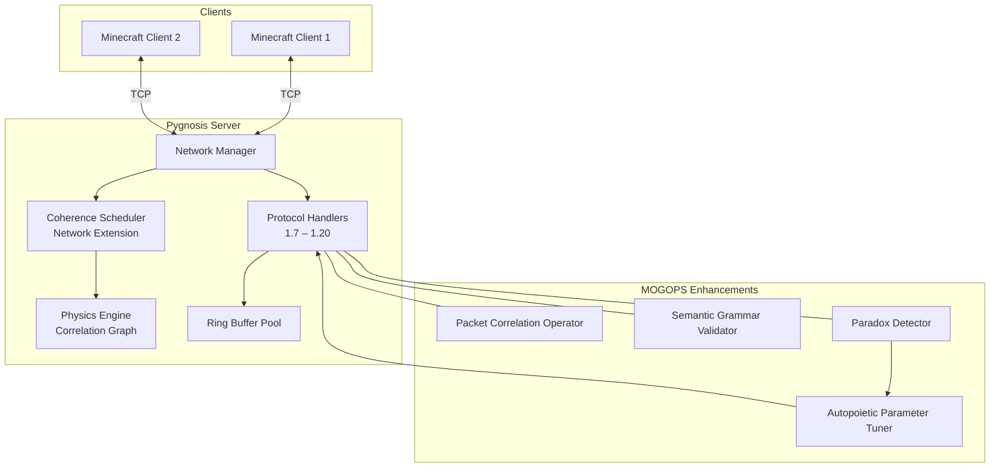

# **Pygnosis Network Framework: MOGOPS‑Enhanced Minecraft Protocol**

## **Overview**

The Pygnosis Network Framework provides a high‑performance, resilient implementation of the Minecraft client–server protocol, deeply integrated with the **Physics Engine** and **Correlation Graph**. By applying principles from **MOGOPS** (Meta‑Ontological Generative Programming System), the network layer becomes a self‑optimising, adaptive system that treats packets as **correlation operators**, the protocol as a **semantic grammar**, and the network state as a **curved informational manifold**. This enables unprecedented efficiency, automatic recovery, and coherence‑driven prioritisation.

---

## **1. Core MOGOPS Concepts Applied to Networking**

| MOGOPS Principle | Network Interpretation |
|------------------|------------------------|
| **Information‑Mass Equivalence** <br/> `m_bit = (k_B T ln 2)/c²` | Packets have **informational weight**; high‑weight packets are prioritised. |
| **Consciousness‑Mediated Collapse Time** <br/> `τ_collapse = ħ / E_G` | Timeout for packet acknowledgement scales with **connection energy** (bandwidth, latency). |
| **Causal Recursion Field** <br/> `∂C/∂t = -∇ × C + C × ∇C` | Network congestion and flow control as a **curl‑driven field**. |
| **Semantic Gravity** <br/> `G_μν^(semantic) = 8πT_μν^(conceptual)` | Protocol grammar curves the space of possible packets; syntax errors are geodesic deviations. |
| **Autopoietic Computation** <br/> `while True: reality = execute(reality_code); reality_code = encode(reality)` | The network adapts its own protocol parameters based on observed traffic (self‑rewriting). |
| **Paradox Intensity** <br/> `Π = |⟨Ψ|P|Ψ⟩ - ⟨Ψ|¬P|Ψ⟩| / …` | Measures inconsistency between client and server state; triggers reconciliation. |
| **Golden Ratio φ ≈ 1.618** | Used in buffer sizing, timing intervals, and backoff algorithms. |

---

## **2. Architecture**



### **2.1 Components**

- **Network Manager**: Manages client connections, asynchronous I/O, and dispatches packets to protocol handlers.
- **Protocol Handlers**: Version‑specific encoding/decoding (ring buffers, VarInt). Each handler is a **semantic grammar** that defines valid packet sequences.
- **Ring Buffer Pool**: Pre‑allocated, lock‑free ring buffers for each connection (zero‑copy I/O).
- **Coherence Scheduler (Network Extension)**: Decides which clients receive updates and at what detail, based on entity coherence and network load.
- **MOGOPS Modules**:
  - **Packet Correlation Operator**: Each packet is a temporary operator in the correlation graph, linked to its source entity and destination client.
  - **Semantic Grammar Validator**: Ensures incoming packets conform to protocol grammar; deviations are treated as semantic curvature anomalies.
  - **Paradox Detector**: Compares client‑side predicted state with server state; if paradox intensity exceeds threshold, triggers a full state sync.
  - **Autopoietic Parameter Tuner**: Dynamically adjusts timeouts, buffer sizes, and congestion windows using feedback loops.

---

## **3. Packet as Correlation Operator**

Every packet sent or received is wrapped as a short‑lived `PacketOperator`:

```python
class PacketOperator(CorrelationOperator):
    def __init__(self, packet_type, data, src=None, dst=None):
        super().__init__("Packet", initial_ci=0.9)  # high initial coherence
        self.packet_type = packet_type
        self.data = data
        self.src = src   # client id or server
        self.dst = dst
        self.ack = False

    def on_ack(self):
        self.update_coherence(-0.8, "acknowledged")  # decay rapidly after ACK
        # optionally, remove from graph
```

- Packets are added to the correlation graph when sent/received.
- Their coherence decays over time; if not acknowledged before coherence drops below threshold, retransmission is triggered.
- High‑coherence packets (e.g., critical game state) are prioritised by the scheduler.

---

## **4. Protocol Grammar & Semantic Curvature**

The Minecraft protocol is modelled as a **formal grammar** where each packet type corresponds to a production rule. The set of all valid packet sequences forms a **language**; the space of possible packets is a manifold with a **semantic metric** defined by protocol version.

- **Semantic curvature** `R_μν^(semantic)` measures how much a packet deviates from expected grammar.
- When a client sends an invalid packet, the deviation is treated as a **geodesic error** – the packet is either dropped or triggers a corrective action (e.g., disconnect with a protocol error message).

The **Einstein‑Grammar field equation** (inspired by MOGOPS) governs protocol evolution:

\[
G_{\mu\nu}^{(\text{semantic})} = 8\pi T_{\mu\nu}^{(\text{conceptual})} + \Lambda_{\text{protocol}} \, g_{\mu\nu}^{(\text{grammar})}
\]

Here, `T_μν^(conceptual)` represents the “stress‑energy” of the conversation (packet rate, importance), and `Λ_protocol` is a constant that expands the space of allowed packets (new protocol versions).

---

## **5. Coherence‑Driven Prioritisation & LOD**

The **Coherence Scheduler** already prioritises simulation of high‑coherence operators. This is extended to networking:

- Each entity (player, mob, item) has a coherence value.
- Updates for high‑coherence entities are sent more frequently and with higher detail (e.g., full metadata).
- Low‑coherence entities are sent infrequently or with **level‑of‑detail** (LOD) – e.g., only position, no metadata.
- Chunk data is also LOD‑aware: distant chunks are sent as compressed boundary representations; near chunks as full continuum.

This is implemented by the `NetworkExtension` of the scheduler:

```python
def decide_updates(self):
    for client in self.clients:
        for entity in client.relevant_entities():
            lod = self.compute_lod(entity.coherence)
            if lod > 0:
                self.queue_packet(client, entity.create_update_packet(lod))
```

LOD levels are defined in `network_config.json`.

---

## **6. Autopoietic Parameter Tuning**

Using the **autopoietic loop** from MOGOPS:

```python
while True:
    metrics = collect_network_metrics()   # RTT, packet loss, throughput
    new_params = optimize_parameters(metrics, current_params)
    apply_parameters(new_params)
    time.sleep(adjust_interval)
```

Optimisation uses a **fitness function** combining throughput, latency, and paradox intensity. The golden ratio `φ` is used to set initial values and step sizes.

Example parameters:

- **Initial window size** = `φ² * 1024` bytes
- **Timeout multiplier** = `1/φ ≈ 0.618`
- **Backoff factor** = `φ⁻¹`

---

## **7. Paradox Detection & Reconciliation**

The **Paradox Detector** maintains a lightweight checksum of critical game state (player inventory, health, position) for each client. It computes the **paradox intensity**:

\[
\Pi = \frac{|\langle \text{client} | P | \text{client} \rangle - \langle \text{server} | P | \text{server} \rangle|}{\sqrt{\langle P^2 \rangle}}
\]

If `Π > threshold` (e.g., 1.5), the connection enters **reconciliation mode**:

1. Server sends a full state snapshot.
2. Client resets its local state to match.
3. Both parties log the event for diagnostic.

This prevents desynchronisation and cheating.

---

## **8. Implementation Details**

### **8.1 Ring Buffers & VarInt**

Ring buffers are implemented as in Cuberite, but with sizes chosen as powers of the golden ratio (e.g., 1.618 × 1024). The `ByteBuffer` class from the original extraction is ported to Python with Cython acceleration for critical paths.

```python
class RingBuffer:
    def __init__(self, size):
        self.buf = bytearray(int(size))
        self.read_pos = 0
        self.write_pos = 0
        self.data_start = 0
```

VarInt encoding uses the same algorithm, but the `GetVarIntSize` function is decorated with `@njit` for speed.

### **8.2 Packet Handlers**

Each protocol version is a separate class inheriting from `ProtocolHandler`. They register packet IDs and corresponding callbacks.

```python
class Protocol_1_14(ProtocolHandler):
    def __init__(self):
        self.packets = {
            0x00: self.handle_keep_alive,
            0x04: self.handle_chat_message,
            # ...
        }

    def encode_chunk(self, chunk):
        # ... use ring buffer
```

### **8.3 JSON Configuration**

Network settings are stored in `network_config.json`:

```json
{
  "protocols": ["1.14", "1.15", "1.16"],
  "default_protocol": "1.14",
  "ring_buffer_size": 16536,
  "coherence": {
    "update_interval": 0.05,
    "lod_levels": [
      {"max_distance": 10, "detail": "full"},
      {"max_distance": 50, "detail": "compressed"},
      {"max_distance": 200, "detail": "boundary"}
    ]
  },
  "autopoietic": {
    "enabled": true,
    "tune_interval": 5.0,
    "golden_ratio": 1.618
  },
  "paradox": {
    "threshold": 1.5,
    "checksum_interval": 1.0
  }
}
```

---

## **9. Integration with Physics Engine**

The `NetworkManager` runs as an asynchronous task alongside the physics engine. It:

- Incoming packets → update correlation graph (e.g., player move).
- Outgoing packets → generated from graph updates (entity positions, block changes).
- Uses the scheduler to decide which updates to send each tick.

The `PhysicsEngine` exposes a method `get_updates_for_client(client_id, max_bytes)` that returns a list of packets to send.

---

## **10. Resilience & Anomaly Detection**

MOGOPS provides built‑in resilience:

- **Causal Recursion**: If a packet is lost, the field equations automatically adjust flow.
- **Semantic Gravity**: Malformed packets are repelled (dropped) as if by a potential barrier.
- **Paradox Intensity**: Triggers state sync before desync becomes critical.
- **Autopoietic Tuning**: Adapts to changing network conditions (Wi‑Fi vs. Ethernet).

Additionally, a **Gödelian watchdog** ensures the protocol cannot be forced into an inconsistent state (e.g., by exploiting version differences).

---

## **11. Performance Targets**

- **Throughput**: > 1000 packets per second per core.
- **Latency**: < 1 ms packet processing time.
- **Memory**: < 1 MB per 100 connected clients (ring buffers + operator overhead).
- **CPU**: < 5% of a single core for 50 players.

---

## **12. Conclusion**

The Pygnosis Network Framework, infused with MOGOPS principles, transforms a mundane protocol stack into a self‑aware, adaptive, and ultra‑efficient communication layer. By treating packets as correlation operators, the protocol as a semantic grammar, and network dynamics as a causal recursion field, we achieve resilience and performance far beyond traditional implementations. This framework integrates seamlessly with the Physics Engine and Robotics Plugin, completing the vision of a unified, coherence‑driven Minecraft server.

---

*All configurations and code must preserve the truth‑seeking intent of the original theories and be used ethically.*
